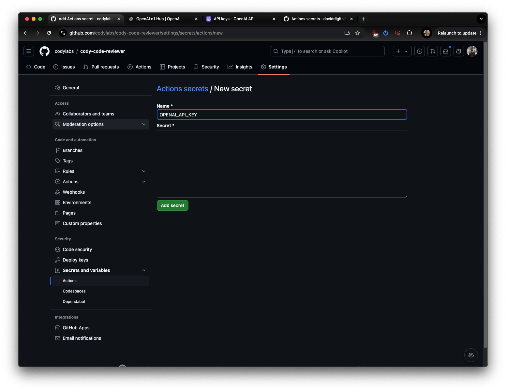
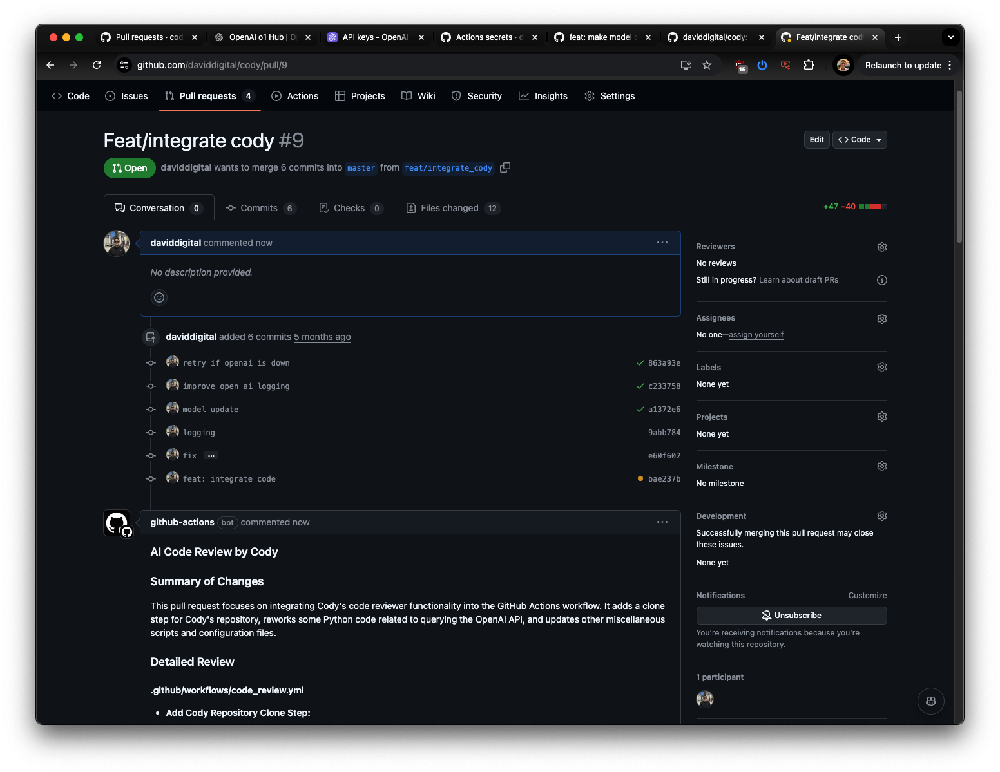

## About

Cody will automatically summarize and code review your changes on every pull request using Open AI models.

Note that an Open API key is required.

Read more at [https://codylabs.io/](https://codylabs.io/)

## Installation

Installation is as simple as adding your Open API key, and creating a Github Actions workflow file to your repo.

1. Add OPENAI_API_KEY as a GitHub repo secret via Settings > Actions > Secrets and variables > New repository secret. The variable name should be OPENAI_API_KEY, and the value should be your Open API API Key.



Note that GITHUB_TOKEN does not need to be added as it is available by default.

2. Add the following file to a new folder in your repo .github/workflows/code_review.yml

```
name: Automated Code Review by Cody

on:
  pull_request:
    types: [opened, synchronize, reopened]

jobs:
  code_review:
    runs-on: ubuntu-latest
    steps:
      - name: Checkout code
        uses: actions/checkout@v3

      - name: Clone cody-code-reviewer repository
        run: |
          git clone https://github.com/codylabs/cody-code-reviewer.git
          cd cody-code-reviewer

      - name: Set up Python 3.9
        uses: actions/setup-python@v4
        with:
          python-version: "3.9"

      - name: Install dependencies
        run: |
          python -m pip install --upgrade pip
          pip install -r requirements.txt

      - name: Run Code Review Model
        run: |
          python src/review_pull_request.py ${{ github.event.pull_request.number }} ${{ github.repository }} > ${{ github.workspace }}/output.txt
        env:
          GITHUB_TOKEN: ${{ secrets.GITHUB_TOKEN }}
          OPENAI_API_KEY: ${{ secrets.OPENAI_API_KEY }}

      - name: Comment on Pull Request
        run: |
          python src/comment_on_pr.py ${{ github.event.pull_request.number }} "${{ secrets.GITHUB_TOKEN }}" ${{ github.repository }}
        env:
          GITHUB_TOKEN: ${{ secrets.GITHUB_TOKEN }}

permissions:
  contents: read
  pull-requests: write
```

3. Commit your code, create a pull request and watch Cody in action!



## Development

Clone the repo.

Note venv (virtual environment) is used so ensure that versions etc are specific to this repo.

`python -m venv venv` and
`pip install -r requirements.txt`

To activiate
`source venv/bin/activate`

To deactivate, `deactivate`

### Testing

Create an .env

```
OPENAI_API_KEY=token_here
GITHUB_TOKEN=token_here
GITLAB_TOKEN=your_gitlab_token_here
```

And then run

`PYTHONPATH=src pytest -s tests/`

This will run the code review logic on an GitHub Pull Request and log the output.

## License

See the LICENSE.md file for details.
