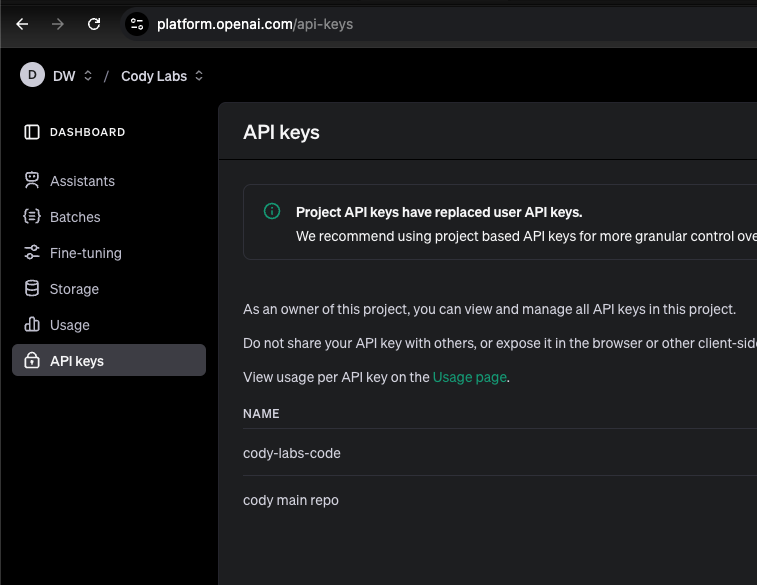
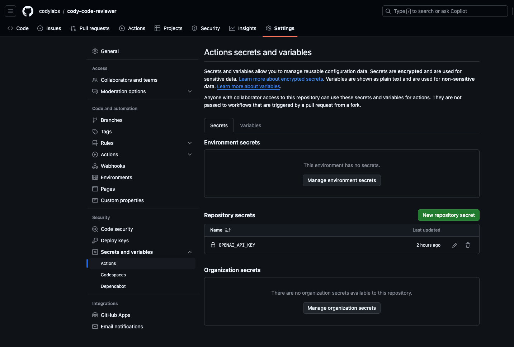
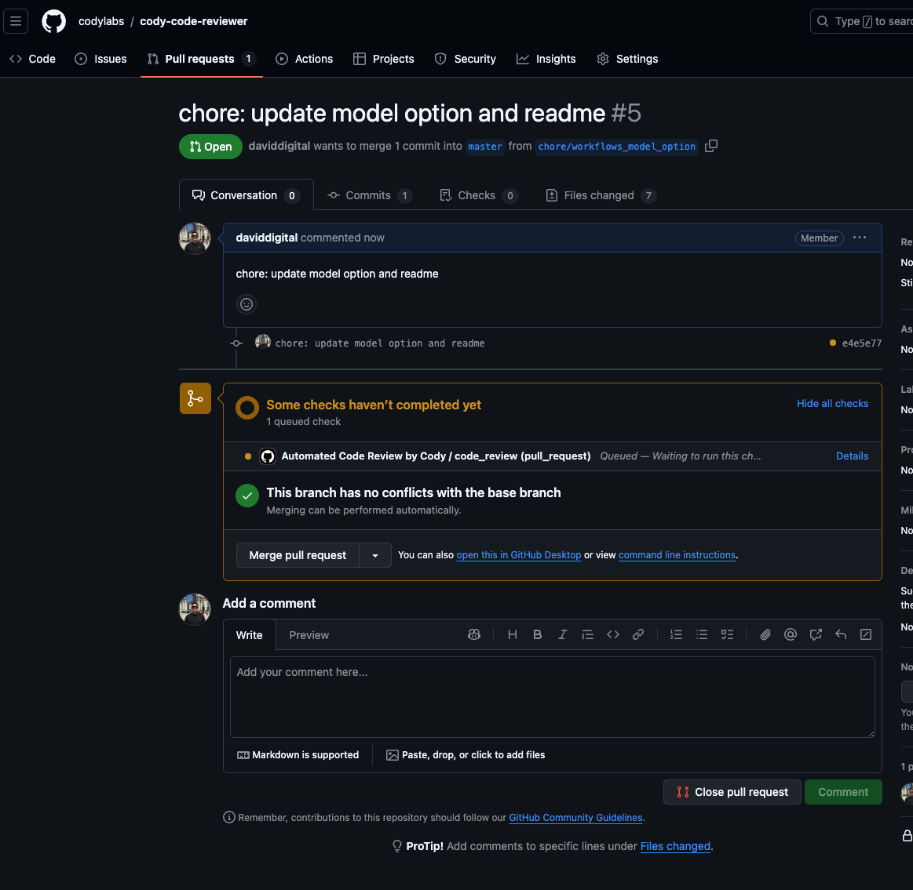
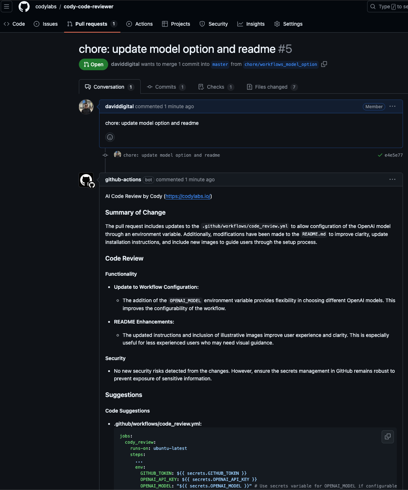

## About

Cody will automatically summarize and code review your changes on every pull request using Open AI models.

Note that an Open AI API key is required.

Read more at [https://codylabs.io/](https://codylabs.io/)

## Installation

Installation is as simple as adding your Open AI API key, and adding a Github Actions workflow file to your repo.

1. Add your OPENAI_API_KEY as a GitHub repo secret via Settings > Actions > Secrets and variables > New repository secret.





Note that GITHUB_TOKEN does not need to be added as it is available by default.

2. Create a new folder and file in your repo **.github/workflows/code_review.yml**

Copy the file from here: [cody_review.yml](https://github.com/codylabs/cody-code-reviewer/blob/master/.github/workflows/code_review.yml)

Or available below:

```
name: Automated Code Review by Cody

on:
  pull_request:
    types: [opened, synchronize, reopened]

jobs:
  code_review:
    runs-on: ubuntu-latest
    steps:
      - name: Checkout code
        uses: actions/checkout@v3

      - name: Clone cody-code-reviewer repository
        run: |
          git clone https://github.com/codylabs/cody-code-reviewer.git
          cd cody-code-reviewer

      - name: Set up Python 3.9
        uses: actions/setup-python@v4
        with:
          python-version: "3.9"

      - name: Install dependencies
        run: |
          python -m pip install --upgrade pip
          pip install -r requirements.txt

      - name: Run Code Review Model
        run: |
          python src/review_pull_request.py ${{ github.event.pull_request.number }} ${{ github.repository }} > ${{ github.workspace }}/output.txt
        env:
          GITHUB_TOKEN: ${{ secrets.GITHUB_TOKEN }}
          OPENAI_API_KEY: ${{ secrets.OPENAI_API_KEY }}
          # Optional: update to a model of your choice from https://platform.openai.com/docs/models
          OPENAI_MODEL: "gpt-4o"

      - name: Comment on Pull Request
        run: |
          python src/comment_on_pr.py ${{ github.event.pull_request.number }} "${{ secrets.GITHUB_TOKEN }}" ${{ github.repository }}
        env:
          GITHUB_TOKEN: ${{ secrets.GITHUB_TOKEN }}

permissions:
  contents: read
  pull-requests: write
```

3. Commit your code, create a pull request and watch Cody in action!





## Development

Clone the repo.

Note venv (virtual environment) is used to ensure that versions etc are specific to this repo.

`python -m venv venv` and
`pip install -r requirements.txt`

To activiate:
`source venv/bin/activate`

To deactivate:
`deactivate`

### Testing

Create an .env:

```
OPENAI_API_KEY=token_here
GITHUB_TOKEN=token_here
GITLAB_TOKEN=your_gitlab_token_here
```

And then run:

`PYTHONPATH=src pytest -s tests/`

## License

See the LICENSE.md file for details.

## Contributing

Contributions are welcome! Whether it's submitting issues, suggesting improvements, or contributing code, we appreciate your input.

Please note that while this project is currently open for contributions, it is not open source. There may be an enterprise plan available in the future that will include additional features and support.

Feel free to reach out via [david@codylabs.io](mailto:david@codylabs.io) if you have any questions or ideas.
