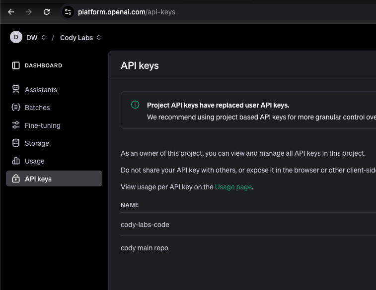
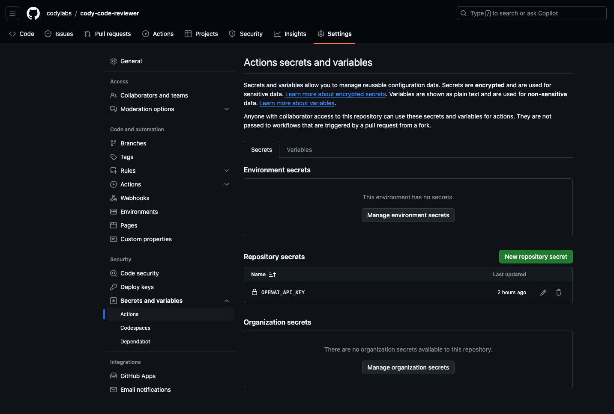
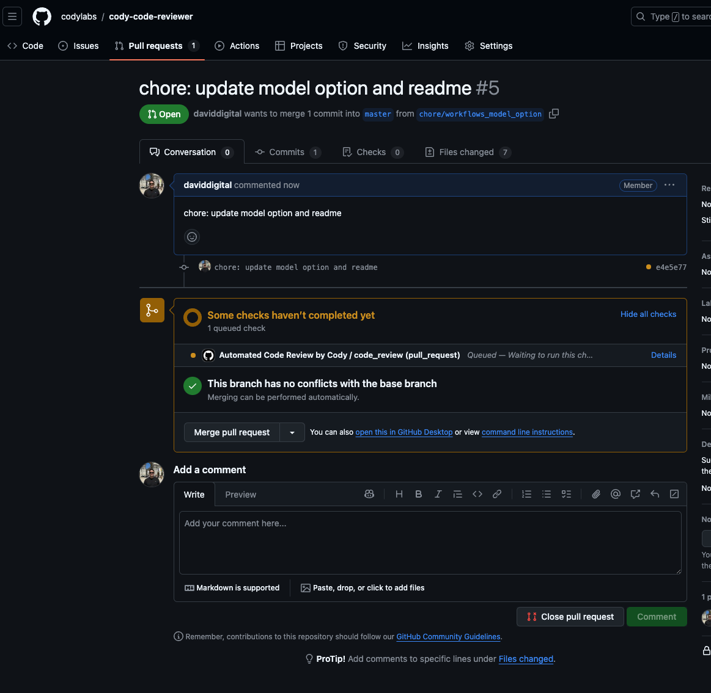
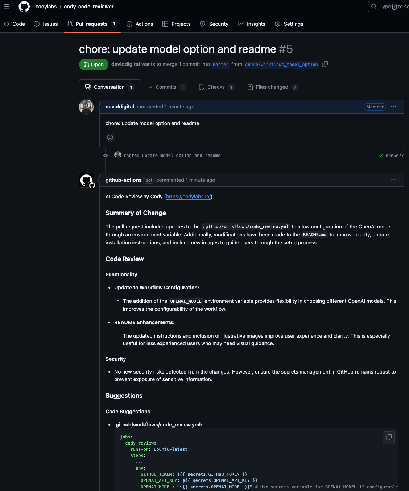

## About

Cody will automatically summarize and code review your changes on every pull request using OpenAI or Anthropic Claude models.

Note that an OpenAI or Anthropic API key is required, depending on the model you choose.

Read more at [https://docs.codylabs.uk/](https://docs.codylabs.uk/)

> **Using GitLab or Azure DevOps?** This action is for GitHub. [Cody Pro for GitLab and Azure DevOps](https://codylabs.gumroad.com/l/cody-pro) provides the same OpenAI and Claude-powered reviews with ready-made pipeline templates.

## Installation

Installation is as simple as adding your AI provider API key and a GitHub Actions workflow file to your repository.

1. Add `OPENAI_API_KEY` (or `ANTHROPIC_API_KEY` for Claude models) as a repository secret under **Settings → Secrets and variables → Actions**.





`GITHUB_TOKEN` does not need to be added because GitHub creates it automatically for each workflow run.

2. Create `.github/workflows/cody-review.yml`:

```yaml
name: Automated Code Review by Cody

on:
  pull_request:
    types: [opened, synchronize, reopened]

jobs:
  code_review:
    if: ${{ github.event.pull_request.head.repo.fork == false }}
    runs-on: ubuntu-latest
    permissions:
      contents: read
      pull-requests: write
    steps:
      - name: Review pull request
        uses: codylabs/cody-code-reviewer@ef39a140710d8f2e6a0f9b69d3cda2a5f4626a06 # v1.5.1
        with:
          openai_api_key: ${{ secrets.OPENAI_API_KEY }}
          model: gpt-5.6-luna
          # To switch to Claude, replace the two lines above with:
          # anthropic_api_key: ${{ secrets.ANTHROPIC_API_KEY }}
          # model: claude-opus-4-8
```

The pull request number, repository and GitHub token are read from the workflow context
automatically. Pass `pr_number`, `repository` or `github_token` explicitly only when you
need to override them (for example, reviewing a different PR than the one that triggered
the run).

The job must grant the token `pull-requests: write` (as in the example above), or the
review cannot be posted. Workflows triggered by pull requests from forks receive a
read-only token; the example's `if` condition skips fork PRs for that reason, so keep it
(or supply a `github_token` with write access) if you accept fork contributions.

The examples pin the action to a release's full commit SHA, which is the recommended way
to use any third-party action: the code that reviews your pull requests can never change
underneath you. New releases are announced on the
[releases page](https://github.com/codylabs/cody-code-reviewer/releases); update the SHA
(and its version comment) when you want to adopt one. Referencing the moving `v1` tag also
works if you prefer automatic updates over supply-chain safety.

3. Commit the workflow, create a pull request, and watch Cody post its review.

## Using Claude models

Cody works with Anthropic's Claude models as well as OpenAI's. To review with Claude:

1. Add ANTHROPIC_API_KEY as a repo secret (create a key at https://platform.claude.com/).
2. Set MODEL to a Claude model in the "Run Code Review Model" step of your workflow:

```yaml
      - name: Review pull request
        uses: codylabs/cody-code-reviewer@ef39a140710d8f2e6a0f9b69d3cda2a5f4626a06 # v1.5.1
        with:
          anthropic_api_key: ${{ secrets.ANTHROPIC_API_KEY }}
          model: claude-opus-4-8
```

Any model name starting with claude- is sent to Anthropic; anything else goes to OpenAI, so you only need the API key for the provider you pick.

| Model | Best for |
| --- | --- |
| claude-fable-5 | Highest-capability, long-running reviews |
| claude-opus-4-8 | Complex code reviews — recommended starting point |
| claude-sonnet-5 | Strong speed and intelligence balance |
| claude-haiku-4-5 | Fastest and cheapest |

The full model list is at https://platform.claude.com/docs/en/about-claude/models/overview.

## GitLab & Azure DevOps (Cody Pro)

Cody Pro brings the same AI code reviews to GitLab merge requests and Azure DevOps pull requests, with ready-made pipeline templates for both platforms and support for the same OpenAI and Claude models. It's a one-time purchase:

**[Get Cody Pro on Gumroad](https://codylabs.gumroad.com/l/cody-pro)**





## Development

Clone the repo.

Note venv (virtual environment) is used to ensure that versions etc are specific to this repo.

`python -m venv venv` and
`pip install --require-hashes -r requirements-dev.lock`

To activate:
`source venv/bin/activate`

To deactivate:
`deactivate`

### Testing

Create an .env:

```
OPENAI_API_KEY=token_here
GITHUB_TOKEN=token_here
GITLAB_TOKEN=your_gitlab_token_here
```

And then run:

`PYTHONPATH=src pytest -s tests/`

When changing dependencies, update `requirements.txt` or `requirements-dev.txt` and regenerate the lock files with:

`uv pip compile --python-version 3.13 --generate-hashes --no-header requirements.txt -o requirements.lock`

`uv pip compile --python-version 3.13 --generate-hashes --no-header requirements-dev.txt -o requirements-dev.lock`

## License

See [LICENSE.md](LICENSE.md) for details.

## Contributing

Contributions are welcome! Whether it's submitting issues, suggesting improvements, or contributing code, we appreciate your input.

Please note that while this project is currently open for contributions, it is not open source. There may be an enterprise plan available in the future that will include additional features and support.

Feel free to reach out by [opening an issue](https://github.com/codylabs/cody-code-reviewer/issues) if you have any questions or ideas.
